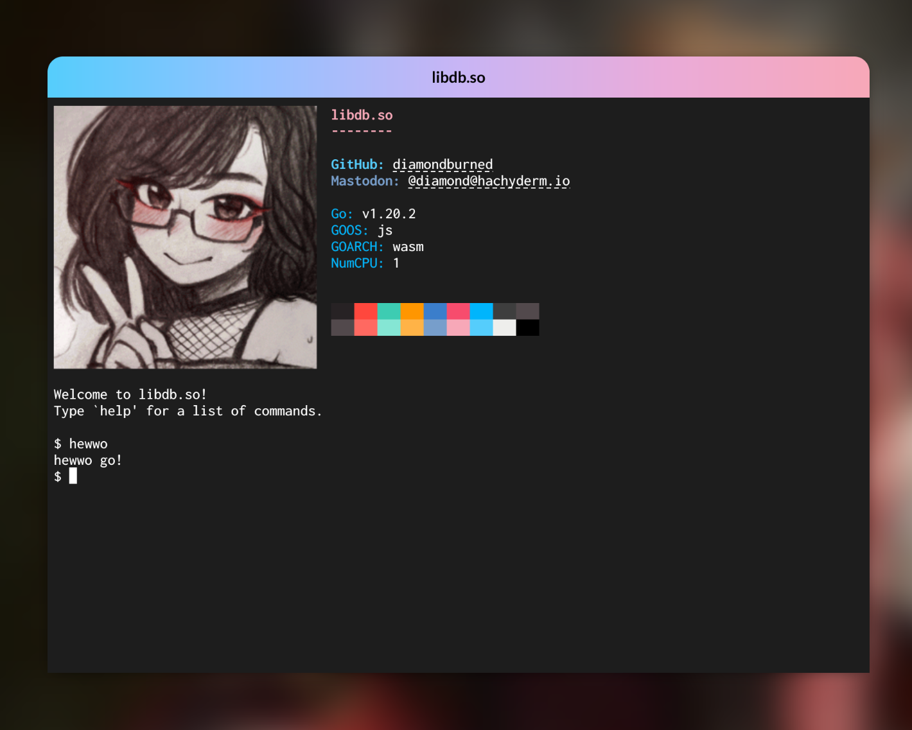

# [libdb.so](https://libdb.so)

Homepage for [libdb.so](https://libdb.so).

[libdb.so](https://libdb.so) is my personal homepage. It is a portfolio-ish
site, but I want it to be a place that's really cool to poke around in.

This project contains the source code for [libdb.so](https://libdb.so). The
project consists of two components:

- Frontend, which is an xterm.js terminal emulator that runs in the browser.
- Backend, which is a Go WebAssembly machine that also runs in the browser.

These two components communicate with each other using WebAssembly calls. They
act almost like traditional computers did with actual physical terminals over a
serial port.

The terminal is fully capable of SIXEL, so images can be printed using either
`cat` or `img2sixel`.

The backend is implemented using custom user-space libraries, such as
[mvdan/sh](https://github.com/mvdan/sh) for a Shell,
[peterh/liner](https://github.com/peterh/liner) for a Readline-like editor, and
`libdb.so/vm` for the VM-like components. Some of these libraries are forked to
add support for WebAssembly and xterm.js.

The goal of this project is partly to show off my programming language stack. It
uses the trinity of Go, TypeScript and Nix. Of which:

- Go is used for the backend, which is the WebAssembly VM.
- TypeScript (with Svelte) is used for the frontend, which runs the xterm.js
  terminal emulator and the Go VM.
- Nix is used for the development and build environments.
